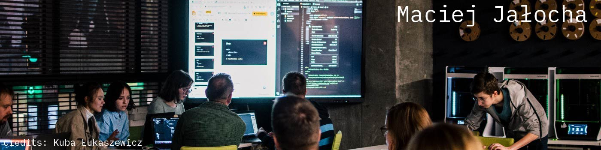

## Hi there 👋

Hi, I'm Maciej, guy behind [StraightenUp](https://chromewebstore.google.com/detail/straightenup-ai-ai-postur/nfhoegpkonllcaghgmhdmcpmebmocokf). I work with Javascript and Python. Feel free to search around my repositories! 
I think most important branches of informatics are ML, cybersecurity and brain-computer interfaces.

My most recent on classification IT Technician questions into categories: [NLP project](https://github.com/PLtier/small-ds-projects/tree/main/NLP%20Exploration) and
[Other DS projects](https://github.com/PLtier/small-ds-projects)

PS.
Currently I'm looking for a student job within IT

<!--
**PLtier/PLtier** is a ✨ _special_ ✨ repository because its `README.md` (this file) appears on your GitHub profile.

Here are some ideas to get you started:

- 🔭 I’m currently working on ...
- 🌱 I’m currently learning ...
- 👯 I’m looking to collaborate on ...
- 🤔 I’m looking for help with ...
- 💬 Ask me about ...
- 📫 How to reach me: ...
- 😄 Pronouns: ...
- ⚡ Fun fact: ...
-->
